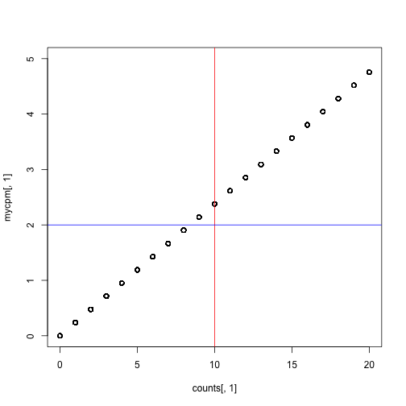
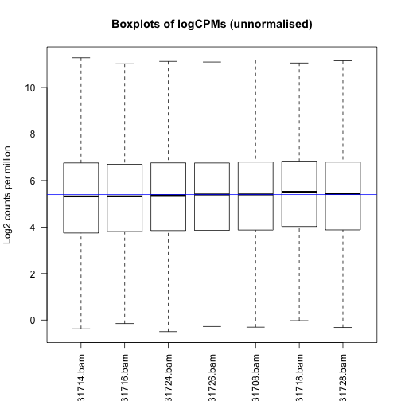
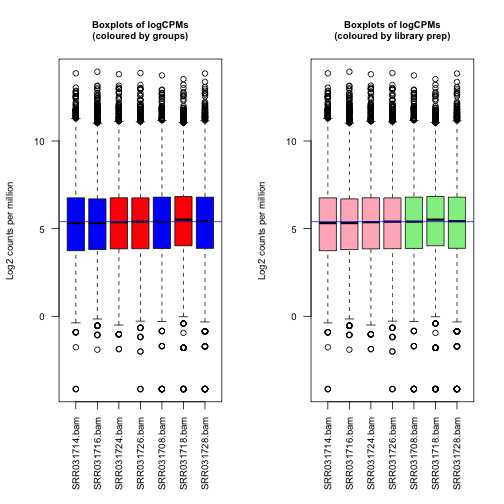

**Author: Belinda Phipson**

## Data files needed

* counts_Drosophila.txt
* targetsD.txt

Available from [https://figshare.com/s/e08e71c42f118dbe8be6](https://figshare.com/s/e08e71c42f118dbe8be6).

## Libraries needed

* limma
* edgeR
* org.Dm.eg.db
* EDASeq
* gplots
* RColorBrewer

## Introduction

The RNA-Seq data we will be analysing today come from this published paper:

Brooks, A.N., Yang, L., Duff, M.O., Hansen, K.D., Park, J.W., Dudoit, S.,
Brenner, S.E. and Graveley, B.R. (2011) Conservation of an rna regulatory
map between drosophila and mammals. Genome Research, 21(2), 193-202.  
http://www.ncbi.nlm.nih.gov/pubmed/20921232

This is a publicly available dataset, deposited in the
Short Read Archive.  The RNA-sequence data are available from GEO under accession nos. GSM461176-GSM461181.  The authors combined RNAi and RNASeq
to identify exons regulated by Pasilla, the Drosophila
melanogaster ortholog of mammalian NOVA1 and NOVA2.
They showed that the RNA regulatory map of Pasilla and
NOVA1/2 is highly conserved between insects and mammals.
NOVA1 and NOVA2 are best known for being involved
in alternative splicing. Cells from S2-DRSC, which is an
embryonic cell line, were cultured and subjected to a treatment
in order to knock-down Pasilla. The four untreated and
three treated RNAi samples were used in the
analysis. The treated samples had Pasilla knocked
down by approximately 60% compared to the untreated
samples. Some of the samples had undergone paired
end sequencing while other samples were sequenced from one end only.

The reads were aligned to the Drosophila reference genome,
downloaded from Ensembl, using the tophat aligner.
The reads were summarised at the gene-level using
htseq-count, a function from the tool HTSeq
(http://wwwhuber.embl.de/users/anders/HTSeq/doc/overview.html).

For the purpose of today's workshop, we will be analysing the gene level counts.

## Reading data into R

First, let's load all the libraries we will need today.

~~~{.r}
library(limma)
library(edgeR)
library(EDASeq)
library(gplots)
library(RColorBrewer)
library(org.Dm.eg.db)
~~~

~~~{.error}
Error in library(org.Dm.eg.db): there is no package called 'org.Dm.eg.db'

~~~

Next, read in the data and targets file:

~~~{.r}
counts <- read.delim(file="data/counts_Drosophila.txt")
targets <- read.delim(file="data/targetsD.txt")
~~~

~~~{.error}
Warning in file(file, "rt"): cannot open file 'data/targetsD.txt': No such
file or directory

~~~

~~~{.error}
Error in file(file, "rt"): cannot open the connection

~~~

Check that the data has read in correctly

~~~{.r}
head(counts)
~~~

~~~{.output}
            SRR031714.bam SRR031716.bam SRR031724.bam SRR031726.bam
FBgn0037213           157           142           213           291
FBgn0000500             0             3             4             5
FBgn0053294            14            18            13            19
FBgn0037215          1666          1948          1662          1833
FBgn0037217            13            19            18            23
FBgn0037218           732           755           803           906
            SRR031708.bam SRR031718.bam SRR031728.bam
FBgn0037213           123           225           164
FBgn0000500             2             1             1
FBgn0053294            22            34            22
FBgn0037215          1625          1701          1870
FBgn0037217            15            15            17
FBgn0037218           695           767           793

~~~

~~~{.r}
targets
~~~

~~~{.error}
Error in eval(expr, envir, enclos): object 'targets' not found

~~~

## Filtering out lowly expressed genes

Our main interest is in testing the treated versus untreated groups. To check how many samples we have in each group we can use the `table` command.

~~~{.r}
table(targets$Group)
~~~

~~~{.error}
Error in eval(expr, envir, enclos): object 'targets' not found

~~~

The minimum sample size is 3. Let's check the relationship between CPM and counts to see what CPM threshold we should be imposing. Recall we're looking for a CPM that corresponds to a count of roughly 10-15.

~~~{.r}
mycpm <- cpm(counts)
plot(counts[,1],mycpm[,1],xlim=c(0,20),ylim=c(0,5))
abline(v=10,col=2)
abline(h=2,col=4)
~~~

We can filter on a CPM of 2 or 3 in at least 3 samples.

~~~{.r}
thresh <- mycpm > 2
keep <- rowSums(thresh) >= 3
table(keep)
~~~

~~~{.output}
keep
FALSE  TRUE 
 7345  7524 

~~~

~~~{.r}
counts.keep <- counts[keep,]
dim(counts.keep)
~~~

~~~{.output}
[1] 7524    7

~~~

We are filtering out about half our genes.

## Convert to DGEList object

~~~{.r}
y <- DGEList(counts.keep)
~~~

## Quality control

Let's do a number of quality control plots.

First, check the library sizes:

~~~{.r}
barplot(y$samples$lib.size)
~~~

Next check the distribution of the counts using an relative log expression plot:

~~~{.r}
plotRLE(y$counts)
~~~

It's a bit hard to see what's going on so we can zoom in to the y axis

~~~{.r}
plotRLE(y$counts,ylim=c(-1,1))
~~~

We can colour by our groups, or by the different library prep.

~~~{.r}
par(mfrow=c(1,2))
group.col <- c("red","blue")[targets$Group]
~~~

~~~{.error}
Error in eval(expr, envir, enclos): object 'targets' not found

~~~

~~~{.r}
plotRLE(y$counts,ylim=c(-1,1),col=group.col)
~~~

~~~{.error}
Error in boxplot.default(groups, ...): object 'group.col' not found

~~~

~~~{.r}
lib.col <- c("light pink","light green")[targets$Library]
~~~

~~~{.error}
Error in eval(expr, envir, enclos): object 'targets' not found

~~~

~~~{.r}
plotRLE(y$counts,ylim=c(-1,1),col=lib.col)
~~~

~~~{.error}
Error in boxplot.default(groups, ...): object 'lib.col' not found

~~~

Looks like some bias going on!

Finally, let's check our MDS plots.

~~~{.r}
par(mfrow=c(1,1))
plotMDS(y)
~~~

~~~{.r}
par(mfrow=c(1,2))
plotMDS(y,col=group.col)
~~~

~~~{.error}
Error in plot.xy(xy, type, ...): object 'group.col' not found

~~~

~~~{.r}
legend("topright",legend=levels(targets$Group),fill=c("red","blue"))
~~~

~~~{.error}
Error in levels(targets$Group): object 'targets' not found

~~~

~~~{.r}
plotMDS(y,col=lib.col)
~~~

~~~{.error}
Error in plot.xy(xy, type, ...): object 'lib.col' not found

~~~

~~~{.r}
legend("topleft",legend=levels(targets$Library),fill=c("light pink","light green"))
~~~

~~~{.error}
Error in levels(targets$Library): object 'targets' not found

~~~

## Hierarchical clustering with heatmap.2

First we need a matrix of log counts:

~~~{.r}
logcounts <- cpm(y,log=TRUE)
~~~

Get variances for genes:

~~~{.r}
var_genes <- apply(logcounts, 1, var)
~~~

Get top 500 most variable

~~~{.r}
select_var <- names(sort(var_genes, decreasing=TRUE))[1:500]
~~~

~~~{.r}
highly_variable_lcpm <- logcounts[select_var,]
dim(highly_variable_lcpm)
~~~

~~~{.output}
[1] 500   7

~~~

~~~{.r}
mypalette <- brewer.pal(11,"RdYlBu")
morecols <- colorRampPalette(mypalette)
# Plot the heatmap
heatmap.2(highly_variable_lcpm,col=rev(morecols(50)),trace="none", main="Top 500 most variable genes across samples",ColSideColors=group.col,scale="row",margins=c(10,5))
~~~

~~~{.error}
Error in heatmap.2(highly_variable_lcpm, col = rev(morecols(50)), trace = "none", : object 'group.col' not found

~~~

~~~{.r}
heatmap.2(highly_variable_lcpm,col=rev(morecols(50)),trace="none", main="Top 500 most variable genes across samples",ColSideColors=lib.col,scale="row",margins=c(10,5))
~~~

~~~{.error}
Error in heatmap.2(highly_variable_lcpm, col = rev(morecols(50)), trace = "none", : object 'lib.col' not found

~~~

## Normalisation

Let's do TMM normalisation

~~~{.r}
y <- calcNormFactors(y)
y$samples
~~~

~~~{.output}
              group lib.size norm.factors
SRR031714.bam     1  4198181    0.9805029
SRR031716.bam     1  4740969    0.9566649
SRR031724.bam     1  4601291    0.9936278
SRR031726.bam     1  5195516    1.0019699
SRR031708.bam     1  3980986    1.0036556
SRR031718.bam     1  4320527    1.0556860
SRR031728.bam     1  4031608    1.0106328

~~~

~~~{.r}
par(mfrow=c(1,2))
plotMD(logcounts,column=2)
abline(h=0,col="grey")
plotMD(y,column = 2)
abline(h=0,col="grey")
~~~

## Differential expression

### Set up design matrix

We want to test for differences between the treated and untreated samples. However, we know that the library preparation adds variability to the data, so we need to account for it in our model. We do this by modelling both Group and Library as variables in our design matrix. This is known as an additive model.

~~~{.r}
design <- model.matrix(~targets$Library + targets$Group)
~~~

~~~{.error}
Error in eval(expr, envir, enclos): object 'targets' not found

~~~

~~~{.r}
design
~~~

~~~{.output}
standardGeneric for "design" defined from package "BiocGenerics"

function (object, ...) 
standardGeneric("design")
<environment: 0x7fea94077f48>
Methods may be defined for arguments: object
Use  showMethods("design")  for currently available ones.

~~~

~~~{.r}
colnames(design) <- c("Int","SEvsPE","UVsT")
~~~

~~~{.error}
Error in `colnames<-`(`*tmp*`, value = c("Int", "SEvsPE", "UVsT")): attempt to set 'colnames' on an object with less than two dimensions

~~~

### Voom transform the data

~~~{.r}
par(mfrow=c(1,1))
v <- voom(y,design,plot=TRUE)
~~~

~~~{.error}
Error in as.vector(x, mode): cannot coerce type 'closure' to vector of type 'any'

~~~

~~~{.r}
par(mfrow=c(1,2))
boxplot(logcounts)
abline(h=median(logcounts),col=4)
boxplot(v$E)
~~~

~~~{.error}
Error in boxplot(v$E): object 'v' not found

~~~

~~~{.r}
abline(h=median(v$E),col=4)
~~~

~~~{.error}
Error in median(v$E): object 'v' not found

~~~

### Test for differential expression

~~~{.r}
fit <- lmFit(v,design)
~~~

~~~{.error}
Error in is(object, "list"): object 'v' not found

~~~

~~~{.r}
fit <- eBayes(fit)
~~~

~~~{.error}
Error in ebayes(fit = fit, proportion = proportion, stdev.coef.lim = stdev.coef.lim, : object 'fit' not found

~~~

~~~{.r}
results <- decideTests(fit)
~~~

~~~{.error}
Error in is(object, "MArrayLM"): object 'fit' not found

~~~

~~~{.r}
summary(results)
~~~

~~~{.error}
Error in summary(results): object 'results' not found

~~~

~~~{.r}
topTable(fit,coef=3,sort.by="p")
~~~

~~~{.error}
Error in is(fit, "MArrayLM"): object 'fit' not found

~~~

### Add annotation from org.Dm.eg.db

The rownames of the fit object are the ensemble gene ids. The `select` function doesn't work in this case, but there is a less elegant way to get around it, using the `toTable` command.

~~~{.r}
# Let's see what we can get in table format from org.Dm.eg.db
ls("package:org.Dm.eg.db")
~~~

~~~{.error}
Error in as.environment(pos): no item called "package:org.Dm.eg.db" on the search list

~~~

~~~{.r}
# Get ensemble annotation
ens <- toTable(org.Dm.egENSEMBL)
~~~

~~~{.error}
Error in eval(expr, envir, enclos): could not find function "toTable"

~~~

~~~{.r}
head(ens)
~~~

~~~{.error}
Error in head(ens): object 'ens' not found

~~~

~~~{.r}
symbol <- toTable(org.Dm.egSYMBOL)
~~~

~~~{.error}
Error in eval(expr, envir, enclos): could not find function "toTable"

~~~

~~~{.r}
genename <- toTable(org.Dm.egGENENAME)
~~~

~~~{.error}
Error in eval(expr, envir, enclos): could not find function "toTable"

~~~

~~~{.r}
# We can use the merge command to merge two dataframes
ann1 <- merge(ens,symbol,by="gene_id")
~~~

~~~{.error}
Error in merge(ens, symbol, by = "gene_id"): object 'ens' not found

~~~

~~~{.r}
head(ann1)
~~~

~~~{.error}
Error in head(ann1): object 'ann1' not found

~~~

~~~{.r}
# Add genename table to ann1
ann2 <- merge(ann1,genename,by="gene_id")
~~~

~~~{.error}
Error in merge(ann1, genename, by = "gene_id"): object 'ann1' not found

~~~

~~~{.r}
head(ann2)
~~~

~~~{.error}
Error in head(ann2): object 'ann2' not found

~~~

Now we need to match up between `rownames(fit)` and the ensemble gene id in `ann2`.

~~~{.r}
m <- match(rownames(fit),ann2$ensembl_id)
~~~

~~~{.error}
Error in rownames(fit): object 'fit' not found

~~~

~~~{.r}
table(is.na(m))
~~~

~~~{.error}
Error in eval(expr, envir, enclos): object 'm' not found

~~~

~~~{.r}
fit$genes <- ann2[m,]
~~~

~~~{.error}
Error in eval(expr, envir, enclos): object 'ann2' not found

~~~

~~~{.r}
topTable(fit,coef=3,sort.by="p")
~~~

~~~{.error}
Error in is(fit, "MArrayLM"): object 'fit' not found

~~~

Let's check the expression of pasilla.

~~~{.r}
ps <- grep("pasilla",fit$genes$gene_name)
~~~

~~~{.error}
Error in grep("pasilla", fit$genes$gene_name): object 'fit' not found

~~~

~~~{.r}
topTable(fit[ps,],coef=3)
~~~

~~~{.error}
Error in is(fit, "MArrayLM"): object 'fit' not found

~~~

## Plots after testing for DE

~~~{.r}
par(mfrow=c(1,2))
plotMD(fit,coef=3,status=results[,"UVsT"])
~~~

~~~{.error}
Error in plotMD(fit, coef = 3, status = results[, "UVsT"]): object 'fit' not found

~~~

~~~{.r}
volcanoplot(fit,coef=3,highlight=100,names=fit$genes$symbol)
~~~

~~~{.error}
Error in is(fit, "MArrayLM"): object 'fit' not found

~~~

~~~{.r}
stripchart(v$E["FBgn0025111",]~targets$Group)
~~~

~~~{.error}
Error in eval(expr, envir, enclos): object 'v' not found

~~~

~~~{.r}
# Check expression of Pasilla
stripchart(v$E["FBgn0261552",]~targets$Group)
~~~

~~~{.error}
Error in eval(expr, envir, enclos): object 'v' not found

~~~

## Testing relative to a threshold

~~~{.r}
fit.treat <- treat(fit,lfc=1)
~~~

~~~{.error}
Error in is(fit, "MArrayLM"): object 'fit' not found

~~~

~~~{.r}
res.treat <- decideTests(fit.treat)
~~~

~~~{.error}
Error in is(object, "MArrayLM"): object 'fit.treat' not found

~~~

~~~{.r}
summary(res.treat)
~~~

~~~{.error}
Error in summary(res.treat): object 'res.treat' not found

~~~

~~~{.r}
topTreat(fit.treat,coef=3)
~~~

~~~{.error}
Error in is(fit, "MArrayLM"): object 'fit.treat' not found

~~~

~~~{.r}
plotMD(fit.treat,coef=3,status=res.treat[,"UVsT"])
~~~

~~~{.error}
Error in plotMD(fit.treat, coef = 3, status = res.treat[, "UVsT"]): object 'fit.treat' not found

~~~

~~~{.r}
abline(h=0,col="grey")
~~~

~~~{.error}
Error in int_abline(a = a, b = b, h = h, v = v, untf = untf, ...): plot.new has not been called yet

~~~

## Gene set testing with goana

~~~{.r}
go <- goana(fit, coef="UVsT",species = "Dm", geneid="gene_id")
~~~

~~~{.error}
Error in goana(fit, coef = "UVsT", species = "Dm", geneid = "gene_id"): object 'fit' not found

~~~

~~~{.r}
topGO(go, n=10)
~~~

~~~{.error}
Error in is.data.frame(results): object 'go' not found

~~~
