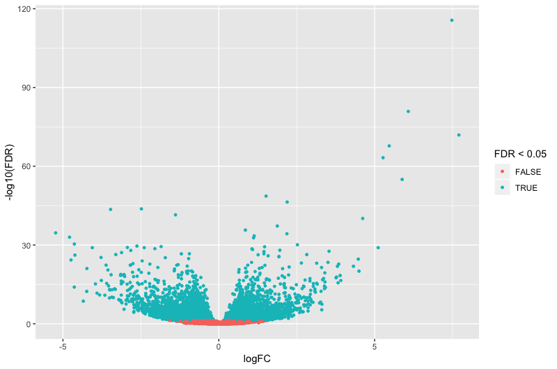

```{r setup, message=FALSE}
library(biomaRt)
library(DESeq2)
library(tidyverse)
```

Before starting this section, we will make sure we have all the relevant objects
from the Differential Expression analysis.

```{r loadData}
load("Robjects/DE.RData")
```

# Overview

- Getting annotation
- Visualising DE results

# Adding annotation to the DESeq2 results

We have a list of significantly differentially expressed genes, but the only
annotation we can see is the Ensembl Gene ID, which is not very informative. 

There are a number of ways to add annotation. One method is to do this using the
*org.Mm.eg.db* package. This package is one of several *organism-level* packages
which are re-built every 6 months. These packages are listed on the [annotation 
section](http://bioconductor.org/packages/release/BiocViews.html#___AnnotationData) 
of the Bioconductor, and are installed in the same way as regular Bioconductor 
packages. 

An alternative approach is to use `biomaRt`, an interface to the 
[BioMart](http://www.biomart.org/) resource. This is the method we will use 
today.

## Select BioMart database and dataset

The first step is to select the Biomart database we are going to access and 
which data set we are going to use.

There are multiple mirror sites that we could use for access. The default is to 
use the European servers, however if the server is busy or inaccessible for some
reason it is possible to access one of the three mirror sites. See the instructions
at [here](https://www.ensembl.org/info/data/biomart/biomart_r_package.html) for detailed
instruction on using different mirrors, but in brief simply add the `host` argument to
the `listMarts` and `useMart` functions below.   

e.g to use the US West mirror:  
  `ensembl=useMart("ENSEMBL_MART_ENSEMBL", host="uswest.ensembl.org")`  

# list the available datasets (species)

```{r connect}
# view the available databases
listMarts()
## set up connection to ensembl database
ensembl=useMart("ENSEMBL_MART_ENSEMBL")

# list the available datasets (species)
listDatasets(ensembl) %>% 
    filter(str_detect(description, "Mouse"))

# specify a data set to use
ensembl = useDataset("mmusculus_gene_ensembl", mart=ensembl)
```

## Query the database

Now we need to set up a query. For this we need to specify three things: 

(a) What type of information we are going to search the dataset on - called
**filters**. In our case this is Ensembl Gene IDs
(b) A vector of the **values** for our filter - the Ensembl Gene IDs from our DE 
results table
(c) What columns (**attributes**) of the dataset we want returned.

Returning data from Biomart can take time, so it's always a good idea to test 
your query on a small list of values first to make sure it is doing what you
want. We'll just use the first 1000 genes for now.

```{r queryBioMart, message=F}

# check the available "filters" - things you can filter for
listFilters(ensembl) %>% 
    filter(str_detect(name, "ensembl"))
# Set the filter type and values
ourFilterType <- "ensembl_gene_id"
filterValues <- rownames(resLvV)[1:1000]

# check the available "attributes" - things you can retreive
listAttributes(ensembl) %>% 
    head(20)
# Set the list of attributes
attributeNames <- c('ensembl_gene_id', 'entrezgene_id', 'external_gene_name')

# run the query
annot <- getBM(attributes=attributeNames, 
               filters = ourFilterType, 
               values = filterValues, 
               mart = ensembl)
```


### One-to-many relationships

Let's inspect the annotation.

```{r inspectAnnot}
head(annot)
dim(annot) # why are there more than 1000 rows?
length(unique(annot$ensembl_gene_id))

# find all rows containing duplicated ensembl ids
annot %>%  
    add_count(ensembl_gene_id) %>%  
    filter(n>1)
```

There are a couple of genes that have multiple entries in the retrieved 
annotation. This is becaues there are multiple Entrez IDs for a single Ensembl 
gene. These one-to-many relationships come up frequently in genomic databases, 
it is important to be aware of them and check when necessary. 

We will need to do a little work before adding the annotation to out results 
table. We could decide to discard one or both of the Entrez ID mappings, or we 
could concatenate the Entrez IDs so that we don't lose information. 

## Retrieve full annotation

> ### Challenge 1 {.challenge}
> That was just 1000 genes. We need annotations for the entire results table.
> Also, there may be some other interesting columns in BioMart that we wish to
> retrieve.  
>
> (a) Search the attributes and add the following to our list of attributes:  
>       (i) The gene description   
>       (ii) The gene biotype  
> (b) Query BioMart using all of the genes in our results table (`resLvV`)  
>
> (c) How many Ensembl genes have multipe Entrez IDs associated with them?  
> (d) How many Ensembl genes in `resLvV` don't have any annotation? Why is this?

```{r solutionChallenge1}
```

### Add annotation to the results table

We can now add the annotation to the results table and then save the results 
using the `write_tsv` function, which writes the results out to a tab
separated file.
To save time we have created an annotation table in which we have modified the 
cumbersome Biomart column names, added median transcript length (we'll need this
in a later session), and dealt with the one-to-many issues for Entrez IDs.

```{r addAnnotation, message=FALSE}
load("Robjects/Ensembl_annotations.RData")
colnames(ensemblAnnot)
annotLvV <- as.data.frame(resLvV) %>% 
    rownames_to_column("GeneID") %>% 
    left_join(ensemblAnnot, "GeneID") %>% 
    rename(logFC=log2FoldChange, FDR=padj)
```

Finally we can output the annotation DE results using `write_csv`.

```{r outputDEtables, eval=F}
write_tsv(annotLvV, "results/VirginVsLactating_Results_Annotated.txt")
```

# Visualisation

`DESeq2` provides a functon called `lfcShrink` that shrinks log-Fold Change 
(LFC) estimates towards zero using and empirical Bayes procedure. The reason for
doing this is that there is high variance in the LFC estimates when counts are 
low and this results in lowly expressed genes appearing to show greater
differences between groups than highly expressed genes. The `lfcShrink` method
compensates for this and allows better visualisation and ranking of genes. We 
will use it for our visualisation of the data.

```{r shrinkLFC}
ddsShrink <- lfcShrink(ddsObj, coef="Status_lactate_vs_virgin")
shrinkLvV <- as.data.frame(ddsShrink) %>%
    rownames_to_column("GeneID") %>% 
    left_join(ensemblAnnot, "GeneID") %>% 
    rename(logFC=log2FoldChange, FDR=padj)
```

## P-value histogram

A quick and easy "sanity check" for our DE results is to generate a p-value 
histogram. What we should see is a high bar at `0 - 0.05` and then a roughly
uniform tail to the right of this. There is a nice explanation of other possible
patterns in the histogram and what to do when you see them in [this 
post](http://varianceexplained.org/statistics/interpreting-pvalue-histogram/).

```{r pvalHist, fig.align="center"}
hist(shrinkLvV$pvalue)
```

## MA plots

MA plots are a common way to visualize the results of a differential analysis. 
We met them briefly towards the end of [Session 
2](02_Preprocessing_Data.nb.html). This plot shows the log-Fold Change for each 
gene against its average expression across all samples in the two conditions
being contrasted.  
`DESeq2` has a handy function for plotting this...

```{r maPlotDESeq2, fig.align="center", fig.width=5, fig.height=5}
plotMA(ddsShrink, alpha=0.05)
```

...this is fine for a quick look, but it is not easy to make changes to the way
it looks or add things such as gene labels. Perhaps we would like to add labels
for the top 20 most significantly differentially expressed genes. Let's use 
the package `ggplot2` instead.

### A Brief Introduction to `ggplot2`

The [`ggplot2`](http://ggplot2.tidyverse.org/) package has emerged as an 
attractive alternative to the traditional plots provided by base R. A full 
overview of all capabilities of the package is available from the 
[cheatsheet](https://www.rstudio.com/wp-content/uploads/2015/03/ggplot2-cheatsheet.pdf).

In brief:-

- `shrinkLvV` is our data frame containing the variables we wish to plot
- `aes` creates a mapping between the variables in our data frame to the 
*aes*thetic properties of the plot:
    + the x-axis will be mapped to log2(`baseMean`)
    + the y-axis will be mapped to the `logFC`
- `geom_point` specifies the particular type of plot we want (in this case a bar 
plot)
- `geom_text` allows us to add labels to some or all of the points
    + see 
    [the cheatsheet](https://www.rstudio.com/wp-content/uploads/2015/03/ggplot2-cheatsheet.pdf) 
    for other plot types

The real advantage of `ggplot2` is the ability to change the appearance of our 
plot by mapping other variables to aspects of the plot. For example, we could 
colour the points based on the sample group. To do this we can add metadata from
the `sampleinfo` table to the data. The colours are automatically chosen by
`ggplot2`, but we can specifiy particular values.


```{r maPlot, fig.align="center", fig.width=5, fig.height=5}
# add a column with the names of only the top 10 genes
cutoff <- sort(shrinkLvV$pvalue)[10]
shrinkLvV <- shrinkLvV %>% 
    mutate(TopGeneLabel=ifelse(pvalue<=cutoff, Symbol, ""))

ggplot(shrinkLvV, aes(x = log2(baseMean), y=logFC)) + 
    geom_point(aes(colour=FDR < 0.05), shape=20, size=0.5) +
    geom_text(aes(label=TopGeneLabel)) +
    labs(x="mean of normalised counts", y="log fold change")
```

## Volcano plot

Another common visualisation is the 
[*volcano plot*](https://en.wikipedia.org/wiki/Volcano_plot_(statistics)) which 
displays a measure of significance on the y-axis and fold-change on the x-axis.

> ### Challenge 2 {.challenge}
> Use the log2 fold change (`logFC`) on the x-axis, and use `-log10(pvalue)` on the y-axis.
> (This `-log10` transformation is commonly used for p-values as it means that more
> significant genes have a higher scale) 
>
> (a) Create a column of -log10(pvalue) values
>
> (b) Create a plot with points coloured by if pvalue < 0.05

An example of what your plot should look like:
   

### Interactive StripChart with Glimma

Before following up on the DE genes with further lab work, a recommended *sanity
check* is to have a look at the expression levels of the individual samples for 
the genes of interest. 

An interactive version of the volcano plot above that includes the raw per 
sample values in a separate panel is possible via the `glXYPlot` function in the
*Glimma* package.


```{r Glimma, eval=FALSE}
library(Glimma)

group <- str_remove_all(sampleinfo$Group, "[aeiou]")

de <- as.integer(shrinkLvV$FDR <= 0.05 & !is.na(shrinkLvV$FDR))

normCounts <- log2(counts(ddsObj))

glXYPlot(
  x = shrinkLvV$logFC,
  y = -log10(shrinkLvV$pvalue),
  xlab = "logFC",
  ylab = "FDR",
  main = "Lactating v Virgin",
  counts = normCounts,
  groups = group,
  status = de,
  anno = shrinkLvV[, c("GeneID", "Symbol", "Description")],
  folder = "volcano"
)
```

This function creates an html page (./volcano/XY-Plot.html) with a volcano plot 
on the left and a plot showing the log-CPM per sample for a selected gene on the
right. A search bar is available to search for genes of interest.

## Heatmap

We're going to use the package `ComplexHeatmap` [@Gu2016]. We'll also use
`circlize` to generate a colour scale [@Gu2014].

```{r complexHeatmap, message=F}
library(ComplexHeatmap)
library(circlize)
```

We can't plot the entire data set, let's just select the top 150 by FDR. We'll
also z-transform the counts.

```{r selectGenes}
# get the top genes
sigGenes <- as.data.frame(shrinkLvV) %>% 
    top_n(150, wt=-FDR) %>% 
    pull("GeneID")

# filter the data for the top 200 by padj in the LRT test
plotDat <- vst(ddsObj)[sigGenes,] %>% 
    assay()
z.mat <- t(scale(t(plotDat), center=TRUE, scale=TRUE))
```

```{r colourScale}
# colour palette
myPalette <- c("red3", "ivory", "blue3")
myRamp = colorRamp2(c(-2, 0, 2), myPalette)
```

```{r heatmap, fig.width=5, fig.height=8}
Heatmap(z.mat, name = "z-score",
        col = myRamp,            
        show_row_names = FALSE,
        cluster_columns = FALSE)
```

we can also split the heat map into clusters and add some annotation.

```{r splitHeatmap, fig.width=5, fig.height=8}
# cluster the data and split the tree
hcDat <- hclust(dist(z.mat))
cutGroups <- cutree(hcDat, h=4)

ha1 = HeatmapAnnotation(df = colData(ddsObj)[,c("CellType", "Status")])

Heatmap(z.mat, name = "z-score",
        col = myRamp,            
        show_row_name = FALSE,
        cluster_columns = FALSE,
        split=cutGroups,
        rect_gp = gpar(col = "darkgrey", lwd=0.5),
        top_annotation = ha1)
```


```{r saveEnvironment, eval=FALSE}
save(annotLvV, shrinkLvV, file="results/Annotated_Results_LvV.RData")
```


# Additional Material
There is additional material for you to work through in the [Supplementary Materials](../Supplementary_Materials/S3_Annotation_and_Visualisation.nb.html) directory. Details include using genomic ranges, retrieving gene models, exporting browser tracks and some extra useful plots like the one below.


--------------------------------------------------------------------------------

# References
