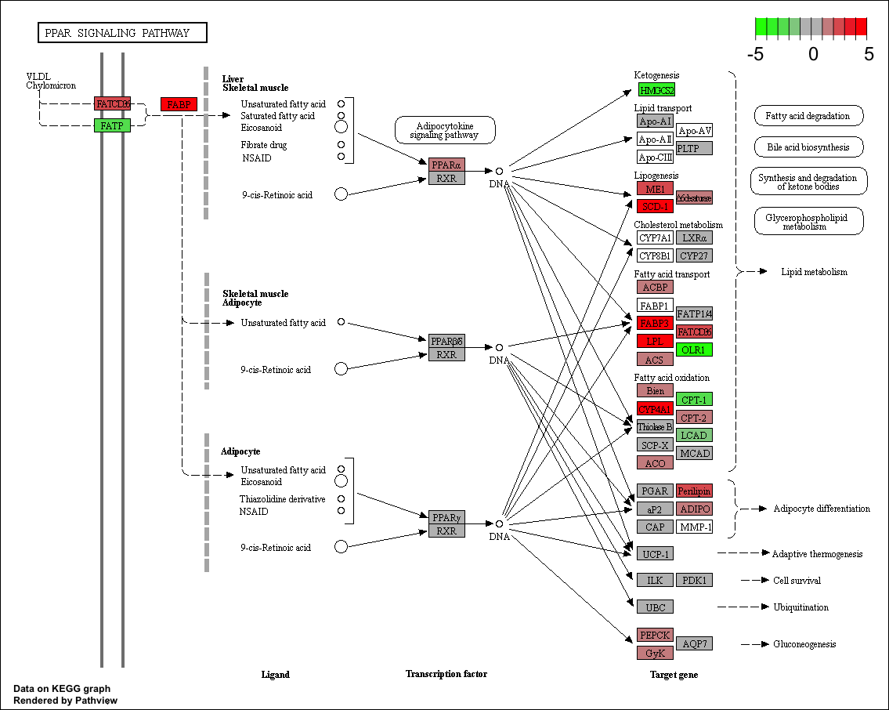

```{r setup, include=FALSE}
library(tidyverse)
```

The list of differentially expressed genes is sometimes so long that its 
interpretation becomes cumbersome and time consuming. A common downstream 
procedure is gene set testing. It aims to understand which pathways or gene 
networks the differentially expressed genes are implicated in.

Various ways exist to test for enrichment of biological pathways.

# GSEA analysis

Gene Set Enrichment Analysis GSEA was tests whether a set of genes of interest, 
e.g. genes
[@Subramanian15545]. The software is distributed by the [Broad 
Institute](http://software.broadinstitute.org/gsea/index.jsp) and is freely 
available for use by academic and non-profit organisations. 

In addition to the GSEA software the Broad also provide a number of very well 
curated `gene set`s for testing against your data - the [Molecular Signatures 
Database (MSigDB)](http://software.broadinstitute.org/gsea/msigdb/index.jsp). 
Unfortunately, these are collections of human genes, however, these lists
have been translated to mouse equivalents by the Walter+Eliza Hall Institutes
Bioinformatics service and made avaialble for [download](http://bioinf.wehi.edu.au/software/MSigDB/).


The analysis is performed by:

- (i) ranking all genes in the `data set`
- (ii) identifying the rank positions of all members of the `gene set` in the 
ranked `data set`
- (iii) calculating an enrichment score (ES) that represents the difference 
between the observed rankings and that which would be expected assuming a random 
rank distribution.

[commentary on GSEA](https://www.ncbi.nlm.nih.gov/pmc/articles/PMC1266131/). 
The article describing the original software is available 
[here](http://www.pnas.org/content/102/43/15545.long).

## `fgsea`

The `fgsea` package [@Sergushichev2016] implements the same algorithm in R [vignette](http://www.bioconductor.org/packages/release/bioc/vignettes/fgsea/inst/doc/fgsea-tutorial.html) "fast preranked gene set enrichment analysis (GSEA)".

```{r fgsea}
library(fgsea)
```

```{r loadData}
load("Robjects/Annotated_Results_LvV.RData")
```

## Ranking Data

We need to provide `fgsea` a vector containing numeric data by which it should 
rank the genes. To start with we will simply use a rank based on their fold 
change. We do not need to rank the genes ourselves, `fgsea` will do this based
on the data we provide.

We need to exclude genes for which we do not have Entrez IDs. Also, we should 
use the shrunk LFC values.

```{r preparedata}
gseaDat <- filter(shrinkLvV, !is.na(Entrez))

rankData <- gseaDat$logFC
names(rankData) <- gseaDat$Entrez
head(rankData)
```

## Load pathways

```{r loadPathways}
load("Robjects/mouse_H_v5.RData")
pathwaysH <- Mm.H
```

## Conduct analysis

```{r runFgsea}
fgseaRes <- fgsea(pathwaysH, 
                  rankData, 
                  minSize=15, 
                  maxSize = 500, 
                  nperm=1000)
```

The warning produced indicates that there are few genes that have the same fold
change and so are ranked equally. `fgsea` with arbitrarily order determine which
comes first in the ranked list. As long as this number is small it shouldn't
significantly effect the results. If the number is large something is 
suspicious about the fold change results.

Lets look at the top 10 results.

```{r top10pathways, eval=FALSE}
fgseaRes %>% 
    arrange(desc(abs(NES))) %>% 
    top_n(10, -padj)
```

```{r top10pathwaysPrint, echo=FALSE}
fgseaRes %>% 
    arrange(desc(abs(NES))) %>% 
    top_n(10, -padj) %>%  
    as_tibble()
```

## Enrichment score plot

```{r gseaEnrichmentPlot}
plotEnrichment(pathwaysH[["HALLMARK_ESTROGEN_RESPONSE_EARLY"]], rankData)
```

Remember to check the [GSEA 
article](http://www.pnas.org/content/102/43/15545.full) for the complete 
explanation.

## GSEA table plot

The function `plotGseaTable` allows us to plot a summary figue showing the 
results for multiple pathways.

```{r gseaTablePlot}
topPathways <- fgseaRes %>% 
    top_n(20, wt=-padj) %>% 
    arrange(-NES) %>% 
    pull(pathway)

plotGseaTable(pathwaysH[topPathways], 
              rankData, 
              fgseaRes, 
              gseaParam = 0.5)
```

> ## Challenge 1 {.challenge}
>
> Another common way to rank the genes is to order by pvalue, but also, sorting
> so that upregulated genes are at start and downregulated at the other - 
> you can do this combining the sign of the fold change and the pvalue.  
> 1. Rank the genes by statisical significance - you will need to create
> a new ranking value using `-log10({p value}) * sign({Fold Change})`  
> 2. Load the "C2" pathways from the the `Robjects/mouse_c2_v5.RData` file   
> 3. Run `fgsea` using the new ranked genes and the C2 pathways  
> 4. Run `fgsea` using the new ranked genes and the H pathways. How do these 
> results differ from the ones we got when ranking by the fold change alone?  

```{r solution1}

```

# GO enrichment analysis

## `goseq`

GOseq is a method to conduct Gene Ontology (GO) analysis suitable for RNA-seq 
data as it accounts for the gene length bias in detection of over-representation [[@Young2010]](https://genomebiology.biomedcentral.com/articles/10.1186/gb-2010-11-2-r14).

From the [GOseq 
vignette](https://www.bioconductor.org/packages/release/bioc/vignettes/goseq/inst/doc/goseq.pdf):

- GOseq first needs to quantify the length bias present in the dataset under
consideration.
- This is done by calculating a Probability Weighting Function or PWF which can 
be thought of as a function which gives the probability that a gene will be
differentially expressed (DE), based on its length alone.
- The PWF is calculated by fitting a monotonic spline to the binary data series 
of differential expression (1=DE, 0=Not DE) as a function of gene length.
- The PWF is used to weight the chance of selecting each gene when forming a 
null distribution for GO category membership.
- The fact that the PWF is calculated directly from the dataset under 
consideration makes this approach robust, only correcting for the length bias 
present in the data.

"GO analysis of RNA-seq data requires the use of random sampling in order to 
generate a suitable null distribution for GO category membership and calculate 
each category's significance for over representation amongst DE genes. ... In 
most  cases,  the  Wallenius distribution can be used to approximate the true 
null distribution, without any significant loss in accuracy. The goseq package 
implements this approximation as its default option."

```{r goSeqPackage, eval=FALSE}
library(goseq)
supportedOrganisms() %>% filter(str_detect(Genome, "mm"))
```

```{r goSeqPackageprint, echo=FALSE, message=FALSE, warning=FALSE}
library(goseq)
supportedOrganisms() %>% filter(str_detect(Genome, "mm"))  %>%  
    as_tibble()
```

## Create a list of differentially expressed genes

The input for `goseq` is a vector that indicates, for each gene, whether or not
it is significantly differentially expressed. This should be a named vector, 
where the names are the gene ids and the values are *`1`* if the gene is 
significant and a *`0`* if it is not.

In this case we can use the Ensembl gene IDs.

```{r getDEGs}
sigData <- as.integer( shrinkLvV$FDR < 0.01 & !is.na(shrinkLvV$FDR) )
names(sigData) <- shrinkLvV$GeneID
```

## Fit the Probability Weighting Function (PWF)

```{r pwFunction}
pwf <- nullp(sigData, "mm10", "ensGene", bias.data = shrinkLvV$medianTxLength)
```

## Conduct GO enrichment analysis

```{r runGoseq, message=FALSE}
goResults <- goseq(pwf, "mm10","ensGene", test.cats=c("GO:BP"))
```

## Plot the top 10

```{r plotGO}
goResults %>% 
    top_n(10, wt=-over_represented_pvalue) %>% 
    mutate(hitsPerc=numDEInCat*100/numInCat) %>% 
    ggplot(aes(x=hitsPerc, 
               y=term, 
               colour=over_represented_pvalue, 
               size=numDEInCat)) +
        geom_point() +
        expand_limits(x=0) +
        labs(x="Hits (%)", y="GO term", colour="p value", size="Count")
```

## Get the GO information for the GO accessions

```{r getGOinfo}
library(GO.db)
GOTERM[[goResults$category[1]]]
```

> ## Challenge 2 {.challenge}
>
> 1. Create a vector showing genes that are statistically significant at 
> FDR < 0.01 and that are up-regulated by at least 4x (logFC>2)
> in lactating mice
> 2. Run a `goseq` analysis on this gene list
> 3. Plot the results
> 4. How is this result different to the previous GO analysis?

```{r solution2, eval=F}

```

# KEGG pathway enrichment analysis

## `clusterProfiler`

We can analyse for enrichment of KEGG pathways in much the same way as for GO 
terms. We could also use `goseq` for this, but this time we're going to use 
`clusterProfiler` [@Yu2012]. `clusterprofiler` supports direct online access of
the current KEGG database, rather than relying on R annotation packages, it
also provides some nice visualisation options.

```{r loadClusterProfiler, message=FALSE}
library(clusterProfiler)
search_kegg_organism('mmu', by='kegg_code')
```

## KEGG enrichment analysis

The input for the KEGG enrichment is list of gene IDs for significant genes. 

This time we'll only use gene with an absolute fold change greater than 2.

For this tool we need to use Entrez IDs, so once again we will have to eliminate
the missing values.

```{r enrichKEGG, eval=FALSE}
sigGenes <- shrinkLvV %>% 
    filter(FDR < 0.05 & !is.na(FDR) & 
               abs(logFC) > 1 & 
               !is.na(Entrez)) %>% 
    pull(Entrez)

kk <- enrichKEGG(gene = sigGenes, organism = 'mmu')
head(kk, n=10)
```

```{r enrichKEGGprint, echo=FALSE}
sigGenes <- shrinkLvV %>% 
    filter(FDR < 0.05 & !is.na(FDR) & 
               abs(logFC) > 1 & 
               !is.na(Entrez)) %>% 
    pull(Entrez)

kk <- enrichKEGG(gene = sigGenes, organism = 'mmu')
head(kk, n=10) %>%  as_tibble()
```

## Visualise a pathway

### In a browser

`clusterProfile` has a function `browseKegg` that allows you to view the Kegg
pathway with the genes colours in in your browser.

```{r browseKegg}
browseKEGG(kk, 'mmu03320')
```

### As a file

The package `pathview` [@Luo2013] can be used to generate figures of KEGG 
pathways. 

One advantage over `clusterProfiles` browser method is that the genes are 
coloured according to their fold change levels in our data. To do this we need
to pass `pathview` a named vector of fold change data (actually you could
colour by any numeric vector, e.g. p-value).

The package plots the KEGG pathway to a `png` file in the working directory.

```{r pathview, message=F}
library(pathview)

logFC <- annotLvV$logFC
names(logFC) <- annotLvV$Entrez

pathview(gene.data = logFC, 
         pathway.id = "mmu03320", 
         species = "mmu", 
         limit = list(gene=5, cpd=1))
```

mmu03320.pathview.png:



> ## Challenge 3 {.challenge}
>
> 1. Use `pathview` to export a figure for "mmu04060", but this time only
> use genes that are statistically significant at FDR < 0.01

```{r solution3, eval=F}

```

---------------------------------------------------------------

# References
