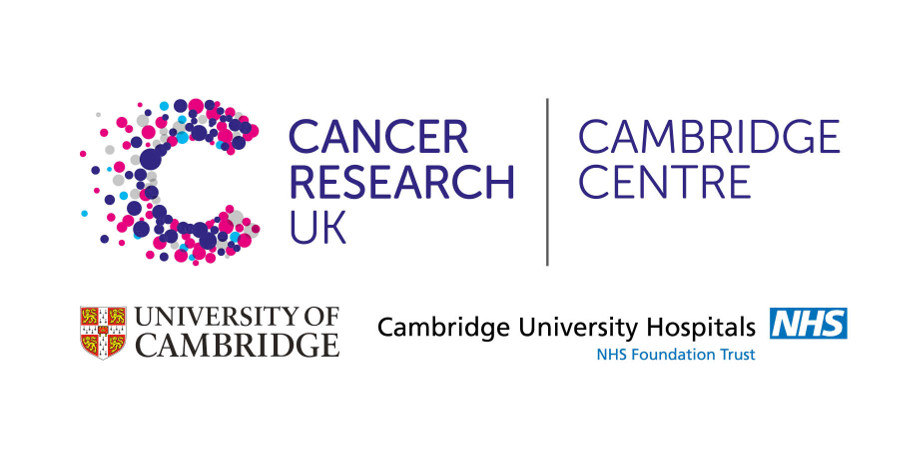

## Acknowledgements

This course is based on the course [RNAseq analysis in R](http://combine-australia.github.io/2016-05-11-RNAseq/) prepared by [Combine Australia](https://combine.org.au/) and delivered on May 11/12th 2016 in Carlton. We are extremely grateful to the authors for making their materials available; Maria Doyle, Belinda Phipson, Matt Ritchie, Anna Trigos, Harriet Dashnow, Charity Law.

## Timetable (for Part 2 )

_Day 2 (p.m.)_

12:30 - 13:30 - Lunch

13:30 - 14:00 - Introduction to RNAseq - Ashley Sawle

14:00 - 14:45 - Importing and QC of RNA-seq data - Ashley Sawle

14:45 - 17:00 - Linear Models and Statistics for Differential Expression - Oscar Rueda

_Day 3_

9:30 - 12:00 - Differential Expression - Ashley Sawle

12:00 - 13:00 Lunch

13:00 - 15:00 Annotation and Visualistaion - Abbi Edwards

15:00 - 17:00 Gene set analysis and Gene ontology testing - Stephane Ballereau

## Outline

In this workshop, you will be learning how to analyse RNA-seq count data, using R. This will include reading the data into R, quality control and performing differential expression analysis and gene set testing, with a focus on the edgeR analysis workflow. You will learn how to generate common plots for analysis and visualisation of gene expression data, such as boxplots and heatmaps. 

This workshop is aimed at biologists interested in learning how to perform differential expression analysis of RNA-seq data when reference genomes are available. 

There is a [course Etherpad](https://public.etherpad-mozilla.org/p/UoC_RNAseqCourse ). Please post questions here and we will answer them as soon as we can (Or if you can answer someone elses question do so!). The trainers may also post useful code snippets here for you.

> ## Prerequisites {.prereq}
>
> __**Some basic R knowledge is assumed (and is essential). Without it, you will struggle on this course.**__ 
> If you are not familiar with the R statistical programming language we
> strongly encourage you to work through an introductory R course before
> attempting these materials.
> We recommend reading our [R crash course](https://bioinformatics-core-shared-training.github.io/r-crash-course/)
> before attending, which should take around 1 hour
>

## Running these materials on your own computer.
- You can of course start from a base R & Rstudio setup but you may find it easier to pull a Docker
container image onto your Linux, Mac or Windows machine (You will need to install [Docker](https://www.docker.com/community-edition) and for Win & Mac we also recommend the [Kitematic](https://github.com/docker/kitematic ) graphical interface to Docker. The image is pullable using 'docker pull mfernandes61/crukci_rnaseq_course'
or searching for 'mfernandes61/crukci_rnaseq_course' in Kitematic.

## Data

- Mouse mammary data (counts): [https://figshare.com/s/1d788fd384d33e913a2a](https://figshare.com/s/1d788fd384d33e913a2a)
- If you are using these materials on your own machine (and not using the Docker Image) and want to do the alignment
yourself in Hisat2 then you will need the raw data obtainable by issuing:   
wget https://ndownloader.figshare.com/articles/3219673?private_link=f5d63d8c265a05618137 -O fastq.zip.  
wget https://ndownloader.figshare.com/articles/3219685?private_link=1d788fd384d33e913a2a -O raw.zip.  
and then unpacking the zip files into your data directory.   

## RNAseq analysis in R tutorials

- [RNA-seq Pre-processing](html/02_Preprocessing_Data.nb.html)
    + [source file](Course_Materials/02_Preprocessing_Data.Rmd)
    + [practical solutions](Course_Materials/solutions/02_Preprocessing_Data.Solutions.Rmd)
- [Differential Expression for RNA-seq](html/04_DE_analysis_with_edgeR.nb.html)
    + [source file](Course_Materials/04_DE_analysis_with_edgeR.Rmd)
    + [practical solutions](Course_Materials/solutions/04_DE_analysis_with_edgeR.Solutions.Rmd)
- [Annotation and Visualisation of RNA-seq results](html/05_Annotation_and_Visualisation.nb.html)
    + [source file](Course_Materials/05_Annotation_and_Visualisation.Rmd)
    + [practical solutions](Course_Materials/solutions/05_Annotation_and_Visualisation.Solutions.Rmd)
- [Gene-set testing](html/06_Gene_set_testing.nb.html)
    + [source file](Course_Materials/06_Gene_set_testing.Rmd)
    + [practical solutions](Course_Materials/solutions/06_Gene_set_testing.Solutions.Rmd)
    
### Lecture slides

- [RNASeq basics](slides/rnaSeqIntro_19June2018.pdf)
- [Linear Model and Statistics for Differential Expression](slides/LinearModels.pdf)

### Supplementary lessons

Introductory R materials:

- [R Crash Course](https://bioinformatics-core-shared-training.github.io/r-crash-course/)

Additional RNAseq materials:

- [Downloading files from SRA and aligning](Supplementary_Materials/S1_Getting_raw_reads_from_SRA.nb.html)
- [Alignment and Counting](Supplementary_Materials/S2_Read_Counts_with_Subread.html)
    + [source file](Supplementary_Materials/S2_Read_Counts_with_Subread.Rmd)

Data: Example Mouse mammary data (fastq files): 
	[https://figshare.com/s/f5d63d8c265a05618137](https://figshare.com/s/f5d63d8c265a05618137)

### Additional resources

[Bioconductor help](https://www.bioconductor.org/help/)  
[Biostars](https://www.biostars.org/)  
[SEQanswers](http://seqanswers.com/)  
