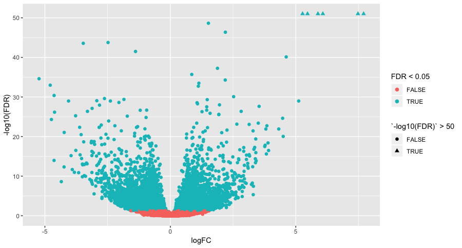

REMEMBER TO COMMENT AS YOU GO!!!!!!!!
SETWD WITH GUI

```{r setup, message=FALSE}
library(biomaRt)
library(DESeq2)
library(tidyverse)
```

Before starting this section, we will make sure we have all the relevant objects
from the Differential Expression analysis.

```{r loadData}
load("../Course_Materials/Robjects/DE.RData")
```

# Overview

- Annotation
- Visualising DE results

# Adding annotation to the DESeq2 results

VIEW resLvV
only see the Ensembl Gene ID, which is not very informative. 

There are a number of ways to add annotation. The are R packages for this at an organism level which are updated every 6 months.

An alternative approach is to use `biomaRt`, an interface to the 
[BioMart](http://www.biomart.org/) resource. This is the method we will use 
today.

## Select BioMart database and dataset

The first step is to select the Biomart database we are going to access and 
which data set we are going to use.

Explain 4 marts

```{r connect}
# view the available databases
listMarts()
## set up connection to ensembl database
ensembl=useMart("ENSEMBL_MART_ENSEMBL")

# list the available datasets (species)
listDatasets(ensembl) %>% 
    filter(str_detect(description, "Mouse"))

# specify a data set to use
ensembl = useDataset("mmusculus_gene_ensembl", mart=ensembl)
```

## Query the database
 set up query
 
* **filters** - what we search with - Ensembl Gene IDs
* **values** - where they are - the Ensembl Gene IDs from our DE results table
* **attributes** - what we want back

* test your query on a small list as it takes a while for the whole lot

```{r queryBioMart, message=F}

# check the available "filters" - things you can filter for
listFilters(ensembl) %>% 
    filter(str_detect(name, "ensembl"))
# Set the filter type and values
ourFilterType <- "ensembl_gene_id"
filterValues <- rownames(resLvV)[1:1000]

# check the available "attributes" - things you can retreive
listAttributes(ensembl) %>% 
    head(20)
# Set the list of attributes
attributeNames <- c('ensembl_gene_id', 'entrezgene_id', 'external_gene_name')

# run the query
annot <- getBM(attributes=attributeNames, 
               filters = ourFilterType, 
               values = filterValues, 
               mart = ensembl)
```


### One-to-many relationships

Let's inspect the annotation.

```{r inspectAnnot}
head(annot)
dim(annot) # why are there more than 1000 rows?
length(unique(annot$ensembl_gene_id)) # why are there less than 1000 Gene ids?

isDup <- duplicated(annot$ensembl_gene_id)
dup <- annot$ensembl_gene_id[isDup]
annot[annot$ensembl_gene_id%in%dup,]
```

missing one is depreceated gene annotation... (our gtf is little older than biomaRt)

There are a couple of genes that have multiple entries in the retrieved 
annotation. This is becaues there are multiple Entrez IDs for a single Ensembl 
gene. These one-to-many relationships come up frequently in genomic databases, 
it is important to be aware of them and check when necessary. 

We will need to do a little work before adding the annotation to out results 
table. We could decide to discard one or both of the Entrez ID mappings, or we 
could concatenate the Entrez IDs so that we don't lose information. 

this illustrates how/why annotation is complicated and difficult

## Retrieve full annotation

> ### Challenge 1 {.challenge}
> That was just 1000 genes. We need annotations for the entire results table.
> Also, there may be some other interesting columns in BioMart that we wish to
> retrieve.  
>
> (a) Search the attributes and add the following to our list of attributes:  
>       (i) The gene description   
>       (ii) The gene biotype  
> (b) Query BioMart using all of the genes in our results table (`resLvV`)  
>
> (c) How many Ensembl genes have multipe Entrez IDs associated with them?  
> (d) How many Ensembl genes in `resLvV` don't have any annotation? Why is this?

```{r solutionChallenge1}
filterValues <- rownames(resLvV)

# check the available "attributes" - things you can retreive
listAttributes(ensembl) %>%
    head(20)
attributeNames <- c('ensembl_gene_id',
                    'entrezgene_id',
                    'external_gene_name',
                    'description',
                    'gene_biotype')

# run the query
annot <- getBM(attributes=attributeNames,
               filters = ourFilterType,
               values = filterValues,
               mart = ensembl)

# dulicate ids
sum(duplicated(annot$ensembl_gene_id))

# missing gens
missingGenes <- !rownames(resLvV)%in%annot$ensembl_gene_id
rownames(resLvV)[missingGenes]
```

### Add annotation to the results table

* we have created an annotation table:
    * modified the column names
    * added median transcript length
    * dealt with the one-to-many issues for Entrez IDs.


```{r addAnnotation, message=FALSE}
load("../Course_Materials/Robjects/Ensembl_annotations.RData")
colnames(ensemblAnnot)
annotLvV <- as.data.frame(resLvV) %>% 
    rownames_to_column("GeneID") %>% 
    left_join(ensemblAnnot, "GeneID") %>% 
    rename(logFC=log2FoldChange, FDR=padj)
```

```{r addAnnotationR, echo=FALSE, message=FALSE}
load("../Course_Materials/Robjects/Ensembl_annotations.RData")
colnames(ensemblAnnot)
annotLvV <- as.data.frame(resLvV) %>% 
    rownames_to_column("GeneID") %>% 
    left_join(ensemblAnnot, "GeneID") %>% 
    rename(logFC=log2FoldChange, FDR=padj)
```

Finally we can output the annotation DE results using `write_tsv`.

```{r outputDEtables, eval=F}
write_tsv(annotLvV, "../Course_Materials/data/VirginVsLactating_Results_Annotated.txt")
```

have to a look and see if genes make biological sense
```{r quickLook}
annotLvV %>%
    arrange(FDR) %>%
    head(10)
```


# Visualisation

* `DESeq2` provides a functon called `lfcShrink` that shrinks log-Fold Change 
(LFC) estimates towards zero  
* genes with low counts and high FC appear be much more significant than they are.
* The `lfcShrink` method
compensates for this and allows better visualisation and ranking of genes. 

```{r shrinkLFC}
ddsShrink <- lfcShrink(ddsObj, coef="Status_lactate_vs_virgin")
shrinkLvV <- as.data.frame(ddsShrink) %>%
    rownames_to_column("GeneID") %>% 
    left_join(ensemblAnnot, "GeneID") %>% 
    rename(logFC=log2FoldChange, FDR=padj)
```

## P-value histogram

A quick and easy "sanity check" for our DE results is to generate a p-value 
histogram. REfer to Oscar's lecture yesterday. What we should see is a high bar in the `0 - 0.05` and then a roughly uniform tail to the right of this.

```{r pvalHist, fig.align="center"}
hist(shrinkLvV$pvalue)
```

## MA plots

MA plots are a common way to visualize the results of a differential analysis. 
We met them briefly towards the end of [Session 
2](02_Preprocessing_Data.nb.html) yesterday.

This plot shows the log-Fold Change against expression but remember its a mean across all the samples

`DESeq2` has a handy function for plotting this...

```{r maPlotDESeq2, fig.align="center", fig.width=5, fig.height=5}
plotMA(ddsShrink, alpha=0.05)
```


### A Brief Introduction to `ggplot2`


In brief:-

- `shrinkLvV` is our data frame containing the variables we wish to plot
- `aes` creates a mapping between the variables in our data frame to the 
*aes*thetic proprties of the plot:
    + the x-axis will be mapped to log2(`baseMean`)
    + the y-axis will be mapped to the `logFC`
- `geom_point` specifies the particular type of plot we want (in this case a scatter 
plot)
- `geom_text` allows us to add labels to some or all of the points
    + see 
    [the cheatsheet](https://www.rstudio.com/wp-content/uploads/2015/03/ggplot2-cheatsheet.pdf) 
    for other plot types

we can add metadata from the `sampleinfo` table to the data. The colours are automatically chosen by
`ggplot2`, but we can specifiy particular values if we want.

Say we want to add top 10 most sig expressed genes to graph at labels, simplest way is to make an extra column with just those values in.

GO RIDICULOUSLY SLOWLY 
they are layers

```{r maPlot, fig.align="center", fig.width=5, fig.height=5}
# add a column with the names of only the top 10 genes
cutoff <- sort(shrinkLvV$pvalue)[10]
shrinkLvV <- shrinkLvV %>% 
    mutate(TopGeneLabel=ifelse(pvalue<=cutoff, Symbol, ""))

ggplot(shrinkLvV, aes(x = log2(baseMean), y=logFC)) + 
    geom_point(aes(colour=FDR < 0.05), shape=20, size=0.5) +
    geom_text(aes(label=TopGeneLabel)) +
    labs(x="mean of normalised counts", y="log fold change")
```

## Volcano plot
Another common visualisation is the 
[*volcano plot*](https://en.wikipedia.org/wiki/Volcano_plot_(statistics)) which 
displays a measure of significance on the y-axis and fold-change on the x-axis.

> ### Challenge 2 {.challenge}
> Use the log2 fold change (`logFC`) on the x-axis, and use `-log10(FDR)` on the y-axis. (This >`-log10` transformation is commonly used for p-values as it means that more significant genes have a >higher scale) 
>
> (a) Create a column of -log10(FDR) values
>
> (b) Create a plot with points coloured by if FDR < 0.05

An example of what your plot should look like:
 

```{r volcanoPlot, fig.height=5, fig.width=7}
# first remove the filtered genes (FDR=NA) and create a -log10(FDR) column
filtTab <- shrinkLvV %>% 
    filter(!is.na(FDR)) %>% 
    mutate(`-log10(FDR)` = -log10(FDR))

ggplot(filtTab, aes(x = logFC, y=`-log10(FDR)`)) + 
    geom_point(aes(colour=FDR < 0.05), size=1)
```

## Strip chart for gene expression

to do a sanity check and look at a specific gene, we can quickly look at grouped expression by using `plotCounts` function of `DESeq2` to  retrieve the normalised expression values 
from the `ddsObj` object and then plotting with  `ggplot2`.


Show reduced objects as you go along 

plotcounts is a function from deseq2 that we can repurpose to pull out the normalised expression for a particular gene.

the expand limits bit is to expand the axis to make sure you include 0

```{r plotGeneCounts}
# Let's look at the most significantly differentially expressed gene
topgene <- filter(shrinkLvV, Symbol=="Wap")
geneID <- topgene$GeneID

plotCounts(ddsObj, gene = geneID, intgroup = c("CellType", "Status"),
           returnData = T) %>% 
    ggplot(aes(x=Status, y=log2(count))) +
      geom_point(aes(fill=Status), shape=21, size=2) +
      facet_wrap(~CellType) +
      expand_limits(y=0)
```


### Interactive StripChart with Glimma

An interactive version of the volcano plot above that includes the raw per 
sample values in a separate panel is possible via the `glXYPlot` function in the
*Glimma* package.


```{r Glimma, eval=FALSE}
library(Glimma)

group <- str_remove_all(sampleinfo$Group, "[aeiou]")

de <- as.integer(shrinkLvV$FDR <= 0.05 & !is.na(shrinkLvV$FDR))

normCounts <- log2(counts(ddsObj))

glXYPlot(
  x = shrinkLvV$logFC,
  y = -log10(shrinkLvV$pvalue),
  xlab = "logFC",
  ylab = "FDR",
  main = "Lactating v Virgin",
  counts = normCounts,
  groups = group,
  status = de,
  anno = shrinkLvV[, c("GeneID", "Symbol", "Description")],
  folder = "volcano"
)
```

This function creates an html page (./volcano/XY-Plot.html) with a volcano plot 

## Heatmap

We're going to use the package `ComplexHeatmap` [@Gu2016]. We'll also use
`circlize` to generate a colour scale [@Gu2014].

```{r complexHeatmap, message=F}
library(ComplexHeatmap)
library(circlize)
```

We can't plot the entire data set, let's just select the top 150 by FDR. We'll
also z-transform the counts.

wt means weight, - for reverse order

Ash mentioned rlog yesterday, use vst today
both avaliable with deseq2, best to check manual to get exact differences
for plotting the differences are subtle so just use vst because its faster

```{r selectGenes}
# get the top genes
sigGenes <- as.data.frame(shrinkLvV) %>% 
    top_n(150, wt=-FDR) %>% 
    pull("GeneID")

# filter the data for the top 200 by padj in the LRT test
plotDat <- vst(ddsObj)[sigGenes,] %>% 
    assay()
z.mat <- t(scale(t(plotDat), center=TRUE, scale=TRUE))
```

* assay pulls out the counts
* z.mat the z-score matrix
* yesterday we used heatmap2 which calculates these automatically for us, for complex heatmap we do it manually
* z- score is fc centred around zero and scaled
* the funtion 'scale' creates the z score for us but it expects data in the opposite orientation so we have to do a couple of transformations to make it work.


skew the scale for us, limits everything outside the myRamp to the truest colour so the small numbers in the middle don't just end up white with no difference.

```{r colourScale}
# colour palette
myPalette <- c("red3", "ivory", "blue3")
myRamp = colorRamp2(c(-2, 0, 2), myPalette)
```

```{r heatmap, fig.width=5, fig.height=8}
Heatmap(z.mat, name = "z-score",
        col = myRamp,            
        show_row_names = FALSE,
        cluster_columns = FALSE)
```

we can also split the heat map into clusters and add some annotation.

hclust generates the same tree we see on the left of our heatmap.

we have to decide at which level we want to cut the tree, 1 is lowest level

ha1 where we get annotation from

rect_gp is grey rectangle around each block
lwt is line weight
```{r splitHeatmap, fig.width=5, fig.height=8}
# cluster the data and split the tree
hcDat <- hclust(dist(z.mat))
cutGroups <- cutree(hcDat, h=4)

ha1 = HeatmapAnnotation(df = colData(ddsObj)[,c("CellType", "Status")])

Heatmap(z.mat, name = "z-score",
        col = myRamp,            
        show_row_name = FALSE,
        cluster_columns = FALSE,
        split=cutGroups,
        rect_gp = gpar(col = "darkgrey", lwd=0.5),
        top_annotation = ha1)
```


```{r saveEnvironment, eval=FALSE}
save(annotLvV, shrinkLvV, file="../Course_Materials/results/Annotated_Results_LvV.RData")
```


# Additional Material
There is additional material for you to work through in the [Supplementary Materials](../Supplementary_Materials/S3_Annotation_and_Visualisation.nb.html) directory. Details include using genomic ranges, retrieving gene models, exporting browser tracks and some extra useful plots like the one below.


--------------------------------------------------------------------------------

# References
